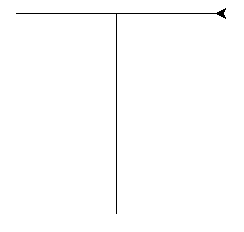
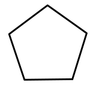
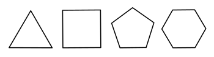
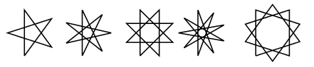
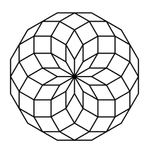
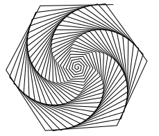

# Cvičení 1

## Základy Pythonu

#### Čísla


```python
>>> 2 * 5
10
>>> 10 / 3
3
>>> 10.0 / 3
3.3333333333333335
```

#### Proměnné

```python
x = 2
y = 5
print x + y
```

#### Podmínky

```python
if x > 10:
    print 'vetsi nez 10'
else:
    print 'mensi nez 10'
```

#### Cykly

```python
for cislo in range(4):
    print cislo
```

▶ [for cyklus krok za krokem][1]
[1]: http://pythontutor.com/visualize.html#code=for+cislo+in+range(4)%3A%0A++++print+cislo&mode=display&origin=opt-frontend.js&cumulative=false&heapPrimitives=false&drawParentPointers=false&textReferences=false&showOnlyOutputs=false&py=2&rawInputLstJSON=%5B%5D&curInstr=0

#### Funkce

```python
# funkce pro vypocet obvodu ctverce
def obvod_ctverce(strana):
    return 4 * strana

>>> obvod_ctverce(10)
40
```

▶ [volání funkce krok za krokem][2]
[2]: http://pythontutor.com/visualize.html#code=def+obvod_ctverce(strana)%3A%0A++++return+4+*+strana%0A%0Aobvod_ctverce(3)%0Aobvod_ctverce(10)&mode=display&origin=opt-frontend.js&cumulative=false&heapPrimitives=false&drawParentPointers=false&textReferences=false&showOnlyOutputs=false&py=2&rawInputLstJSON=%5B%5D&curInstr=0

#### Matematicka knihovna

```python
# z knihovny math importujeme funkci sqrt a konstantu pi
from math import sqrt, pi

print sqrt(4)
# vypise 2.0

print pi
# vypise 3.14159265359
```

#### Ukázkový program
Ukázkový program (vytváření sítě):
[seznameni.py](https://github.com/effa/ib111/blob/master/seznameni.py)

### První úloha: Opakování
Pomocí for cyklu napište 100 krát větu *"Na cviceni se chodi vcas"*.

Pak napište funkci, která umožní výpis libovolné věty libovolněkrát.

    def opakuj(veta, kolikrat):
        ...

    >>> opakuj('Hello!', 4)
    Hello!
    Hello!
    Hello!
    Hello!


## Želví grafika

```python
# import knihovny pro zelvi grafiku
from turtle import *

# na zatacku je zelva natocena doprava,
# my si ji ted otocime nahoru (na sever)
left(90)

# kresleni
forward(200)
left(90)
forward(100)
backward(200)

# ukonceni kresleni
done()
```


Totéž pomocí funkce:

```python
# import knihovny pro zelvi grafiku
from turtle import *

def tecko(velikost):
  left(90)
  forward(velikost)
  left(90)
  forward(velikost/2)
  backward(velikost)
  done()

>>> tecko(200)
```

▶  [dokumentace knihovny turtle](http://docs.python.org/library/turtle.html)

### Jednoduché obrázky
Nejprve si zkuste nakreslit nejaké jednoduché obrázky jako trojúhelník, čtverec nebo domeček.

Pro další obrázky si už vždy napište obecnou funkci.

### Pětiúhelníky

    def petiuhelnik(delka_strany):
        ...

    >>> petiuhelnik(100)



### Mnohoúhelníky

    def mnohouhelnik(n, delka_strany):
        ...

    >>> mnohouhelnik(3, 100)
    >>> mnohouhelnik(4, 90)
    ...



### Hvěždy

    def hvezda(vrcholy, skok, delka):
        ...

    >>> hvezda(5, 2, 200)



### Diamant

    def diamant(n, delka):
        ...

    >>> diamant(12, 30)



### Spirála

    def spirala(n, uhel, krok):
        ...

    >>> spirala(140, 61, 1)



