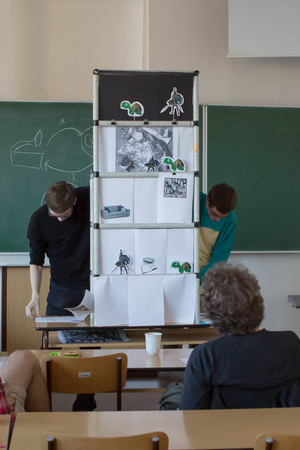
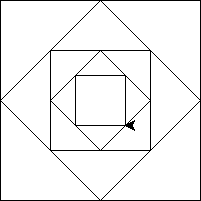
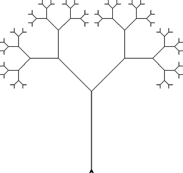
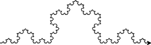
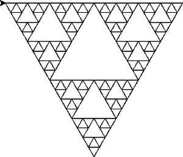
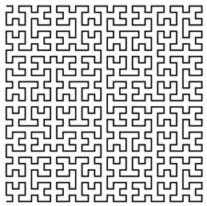
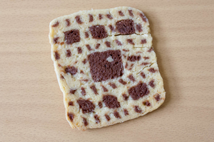

# Cvičení 8: Rekurze

    Syn: Kolik otoček potřebuju na zašroubování žárovky?
    Otec: Pokud už je zašroubovaná, tak 0.
          Jinak ji zatoč jednou, zeptej se mě znova a k mé odpovědi přičti 1.

Rekurze je využití sebe sama. Typickými příkladem je rekurzivní definice, tedy
použití X v definici X. Můžeme třeba definovat funkci
faktoriál pomocí funkce faktoriál:

```
0! = 1
n! = n * (n - 1)! pro n > 0
```

Při programování se pak rekurze objeví jako funkce, která pro výpočet využívá
sebe sama. Téměř jedna ku jedné můžeme k definici matematické funkce
*faktoriál* napsat definici výpočetní funkce `faktorial` v Pythonu:

```python
def faktorial(n):
    if n == 0:
        return 1
    else:
        return n * faktorial(n-1)
```

▶ [vizualizace průběhu výpočtu][1]
[1]: http://pythontutor.com/visualize.html#code=def+faktorial(n)%3A%0A++++if+n+%3D%3D+0%3A%0A++++++++return+1%0A++++else%3A%0A++++++++return+n+*+faktorial(n-1)%0A++++++++%0Afaktorial(5)&mode=display&origin=opt-frontend.js&cumulative=false&heapPrimitives=false&drawParentPointers=false&textReferences=false&showOnlyOutputs=false&py=2&rawInputLstJSON=%5B%5D&curInstr=0

Nejedná se o *definici v kruhu*, protože v každém kroku dochází ke
zjednodušování (faktoriál `n` je definován pomocí faktoriálu `n - 1`) a je
definován i bázový případ (`n = 0`) bez rekurze, ke kterému vše směřuje.
Jde tedy spíše o *definici ve spirále*.

Při výpočtech dochází k zanořování do hlubších úrovní rekurze, které si lze
taky představit jako vršení rozpočítaných verzí funkce na sebe. Podobně, jako
se na následující fotce z dialogu mezi Achillem a Želvou na sebe kupí započaté příběhy:




Další ukázkou rekurzivního algoritmu je výpočet největšího společného dělitele,
zde už však není 1 ku 1 korespondence s obvyklou definicí NSD. Korektnost
funkce tady vyplývá z korektnosti zjednodušovacího rekurzivního kroku a korektnosti
bázového případu.

```python
def nsd(a, b):
    if b == 0:
        return a
    else:
        return nsd(b, a % b)
```

▶ [vizualizace průběhu výpočtu][2]
[2]: http://pythontutor.com/visualize.html#code=def+nsd(a,+b)%3A%0A++++if+b+%3D%3D+0%3A%0A++++++++return+a%0A++++else%3A%0A++++++++return+nsd(b,+a+%25+b)%0A%0Ansd(36,+42)&mode=display&origin=opt-frontend.js&cumulative=false&heapPrimitives=false&drawParentPointers=false&textReferences=false&showOnlyOutputs=false&py=2&rawInputLstJSON=%5B%5D&curInstr=0


Rekurze je příkladem obecnějšího jevu odkazování na sebe sama, tzv.
*sebe-reference*. Sebe-refence se vyskytuje v jazyce (*Třeba tato věta mluví sama
o sobě.*), v knihách, v divadle, ve filmu, ale dokonce i v matematice. Sebe-reference
je dokonce hlavní ingrediencí nejslavnajších důkazů matematiky (*Gödelovy věty
o neúplnosti*) a také informatiky (*existence problémů, pro které neexistuje
algoritmus, který by je řešil &ndash; např. problém zastavení*)

Vedle rekurze jsou nejtypičtějším zástupcem sebe-reference
[fraktály](https://www.google.cz/search?q=fractals), obrázky,
které jsou *soběpodobné*, tedy jejich části připomínají obrázek jako celek.
Fraktály můžete objevit všude možně v přírodě (např. větve stromů, kapradina).

Fraktály a rekurze nejsou dva nezávislí reprezentanti sebe-reference, i mezi
nimi je silná souvislost. Rekurze je totiž velmi elegantní
způsob, jak jednotlivé fraktály definovat. Díky tomu často můžeme složité
fraktály vykreslit pomocí jednoduchých rekurzivních funkcí.


## Součet čísel rekurzivně

Napište rekurzivní funkci pro součet čísel od `1` do `n`.

```
>>> soucet(5)
15
```

## Prvek posloupnosti rekurzivně

Napište rekurzivní funkci, která počítá n-tý prvek posloupnosti definované
následujícím indutkivním způsobem:

a<sub>0</sub> = 5; a<sub>n</sub> = 2 * a<sub>n-1</sub> - 1

```
>>> posloupnost(3)
33
```

Podobně napište rekurzivní funkci pro výpočet n-tého prvku Fibonacciho
posloupnosti. Tento přímý způsob výpočtu je pro Fibonacciho posloupnost
extrémně neefektivní. Proč? A co s tím?

## Součet seznamu čísel rekurzivně

Napište rekurzivní funkci pro součet seznamu čísel.

```
>>> soucet_seznamu([1, 8, 2, 0, 4, 2])
17
```

## Hanojské věže

Napište funkci, která vypíše řešení
[Hanojských věží](http://www.softschools.com/games/logic_games/tower_of_hanoi/)
pro libovolný počet kamenů.

```python
# Vypise premistovani kamenu pri reseni Hanojskych vezi.
#    - n:     pocet kamenu
#    - odkud: misto, kde stoji vez na zacatku
#    - kam:   misto, kam se ma vez premistit
#    - kudy:  misto, ktere se muze k presouvani pouzit
def hanoi(n, odkud, kam, kudy):
    pass
```

Příklad volání:
```
>>> hanoi(3, 'A', 'C', 'B')

A -> C
A -> B
C -> B
A -> C
B -> A
B -> C
A -> C
```

## Fraktály

Pomocí knihonvy `turtle` napište funkce, které vykreslí následující fraktály.

### Vnořené čtverce



### Stromeček


### Kochova vločka



### Siepernského trojúhelník




## Bonusové úlohy

* variace na stromeček (zkuste měnit stupeň větvení, změnu délky větví,
  naklonění větví, ...)
* Hilbertova křivka (případně další fraktály ze slidů nebo jakékoliv jiné)



* fraktálové sušenky (pro vyplňování použijte funkci [fill](https://docs.python.org/2/library/turtle.html#turtle.fill) z knihovny turtle)



* Hanojské věže graficky

* Robotanik na [tutor.fi.muni.cz](http://tutor.fi.muni.cz)
