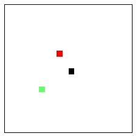
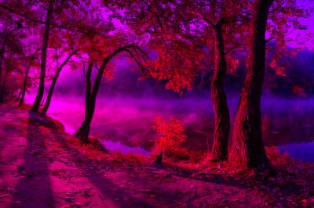
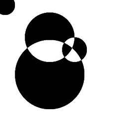
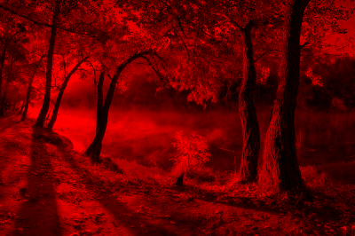
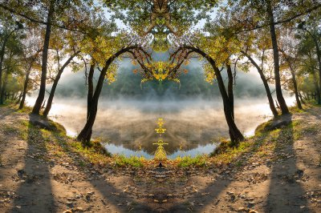
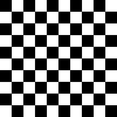
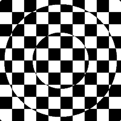

# Cvičení 12: Bitmapová grafika

Pro bitmapovou grafiku budeme využívat knihovnu PIL, která není součástí
standardních knihoven Pythonu. Na svůj počítač si můžete nainstalovat buď PIL nebo
novější a udržovanou knihovnu Pillow (pro naše účely jsou obě knihovny totožné,
takže je jedno, kterou z nich si nainstalujete).

* [instalace Pillow pro Linux/Mac](http://pillow.readthedocs.org/en/latest/installation.html)
* [instalace Pillow pro Windows](http://www.lfd.uci.edu/~gohlke/pythonlibs/#pil)

### Kreslení


```python
from PIL import Image

# konstanta pro trojici reprezentujici bilou barvu
WHITE = (255,255,255)

def demo():
    # vytvoreni noveho obrazku (model, velikost, barva pozadi)
    im = Image.new("RGB", (20,20), WHITE)
    # obarveni 3 pixelu (pozice, barva)
    im.putpixel((10,10), (0,0,0))
    im.putpixel((8,7), (255,0,0))
    im.putpixel((5,13), (100,255,105))
    # zobrazeni obrazku
    im.show()
    # ulozeni obrazku
    im.save("demo.png")
```



### Transformace obrázku


```python
def odstran_zelenou(nazev):
    im = Image.open(nazev)
    im.convert("RGB")
    sirka, vyska = im.size
    for x in range(sirka):
        for y in range(vyska):
            (r, g, b) = im.getpixel((x, y))
            im.putpixel((x, y), (r, 0, b))
    im.save("without-green.png")
```




## Kruh

Napište funkci pro vykreslení kruhu.


```python
# Vykresli cerny kruh s danym polomerem na ctvercovy obrazek o strane 'rozmer'
def kruh(rozmer, polomer):
    pass
```

### Překrývající se kruhy

Napište funkci, která vykreslí více černých kruhů. Každé překrytí
kruhů invertuje pozadí kruhu.



```python
# Vykresli na ctvercovy obrazek o strane 'velikost_obrazku' kruhy zadane
# pomoci promenne 'seznam_kruhu', coz je seznam, v nemz kazda polozka je
# dvojice stred a polomer (ukazka nize).
def kruhy(velikost_obrazku, seznam_kruhu):
    pass

>>> seznam_kruhu = [
...     ((20, 20), 40),
...     ((200, 150), 100),
...     ((200, 300), 140),
...     ((300, 200), 50),
... ]
>>> kruhy(500, seznam_kruhu)
```

## Pouze červená

Napište funkci, která načte obrázek a vykreslí obrázek, který
vznikne tak, že z každého pixelu zachováme pouze jeho červenou složku.



```python
def pouze_cervena(obrazek):
    pass
```

## Zrcadlový obraz

Napište funkci, která načte obrázek a vykreslí obrázek, který
vznikne zrcadlením původního.



```python
def zrcadleni(obrazek):
    pass
```

## Šachovnice

Nakreslete šachovnici zadanou velikostí a šířkou pruhu.



```python
def sachovnice(velikost=150, pruh=10):
    pass
```


## Šachovnice s kruhy

Rozšiřte předchozí příklad o inverzi barev podle kružnic s násobkem zadaného
poloměru.



```python
def sachovnice_s_kruhy(velikost=500, pruh=25, polomer=57):
    pass
```

## Bonusové úlohy

* Rozšiřte úlohu s invertovanými kruhy tak, aby místo zadaných kruhů vykreslila
  funkce spoustu kruhů, které náhodně vygeneruje.
* Za použití toho, co umíte, zkuste vyřešit skrývačky ze
[stránek předmětu](http://www.fi.muni.cz/~xpelanek/IB111/?p=cviceni).
* Kreslení dalších obrazců: kružnice, trojúheník, elipsa, ...

