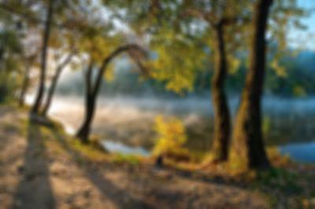
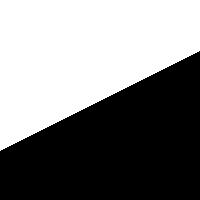
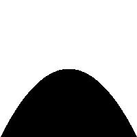
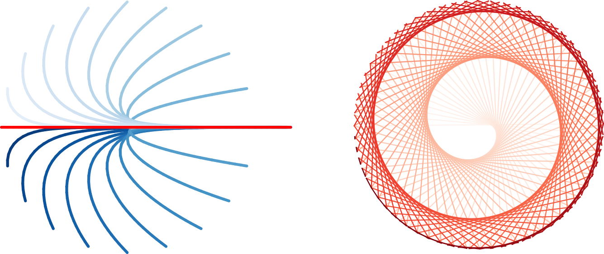

# Domácí úloha 5: Text a obrázky
* Termín odevzdání: neděle 17. 12 (soft deadline).
* Pro případ nouze bude odevzdávárna otevřená až do středy 27. 12. (hard deadline).
* Odevzdejte jediný soubor `homework_05.py`.
* Odevzdávárna:
  [IS / Student / FI:IB111 / Odevzdávárny / Domácí úloha 5](https://is.muni.cz/auth/el/1433/podzim2017/IB111/ode/s03/ode_hw5/)
* Pište přehledný kód, používejte vhodná jména proměnných, odstraňte duplicitní kód.
* Případné složitější konstrukce opatřete komentářem.
* Nepoužívejte diakritiku (ani v komentářích).
* Úlohu vypracujte zcela samostatně.
* Řešení domácí úlohy si užijte :-)

## Zadání

Tato úloha nemá kostru a je zadána částečně otevřeně, abyste se mohli zaměřit na to, co vám přijde zajímavé. Za skvělé řešení můžete získat i bonusové body.
Do komentářů uveďte, jakým způsobem či v jakém rozsahu jednotlivé úlohy řešíte
a na konec připojte i ukázková volání.

### Analýza křestních jmen (5 bodů)

Využijte soubor s anglickými jmény [names.txt](./names.txt).
Vypočítejte, kolik jmen začíná na které písmeno
a vypište tyto počte sestupně:

```
M : 487
L : 430
C : 413
A : 394
...
```

Dále pomocí textové grafiky vykreslete graf četností
(písmena na x-ové ose opět seřaďte sestupně podle četností).
Výsledek může vypadat nějak takto:

```
500 #
450 ##
400 #####
350 ######
300 #######
250 ###########
200 ############
150 ###############
100 ####################
 50 #######################
    MLCASJDRETKBGNHVFPWIOYZQUX
```


### Hledání jména pro potomka (5 bodů)

Napište funkci `find_name_for_your_child()`,
která pomůže interaktivně vybrat vhodné jméno (případně více jmen) pro dítě pomocí několika otázek, např.:
* jaké má být první písmeno
* maximální délka jména
* minimální počet samohlásek
* maximální počet různých písmen
* obsahující nějaké požadované písmeno alespoň N-krát
* ...

Implementujte alespoň 3 kritéria (dekomponujte je do pomocných funkcí).
Funkce `find_name_for_your_child()` se postupně zeptá na tato kritéria
a měla by umožnit kritérium přeskočit, pokud pro uživatele není důležité.
Nakonec vypíše všechna jména, která splňují všechna zadaná kritéria,
seřazená abecedně.


### Rozmazání obrázku (5 bodů)

Napiště funkci `blur(filename='landscape.jpg', radius=4)`, která daný obrázek rozmaže a ukáže výsledek. Funkce bere jako parametry cestu ke zdrojovému obrázku a míru rozmazání. Výsledek může vypadat následovně:




### Prolnutí obrázků (5 bodů)

Napiště funkci `combine(left='left.jpg', right='right.jpg')`,
která nějakým způsobem skombinuje dva obrázky (stejné velikosti) do jednoho,
například plynulým přechodem od jednoho ke druhému:


### Funkční krajina (5 bodů)

Napište funkci `draw_function(function, size=200)`, která vykreslí předanou funkci `function` na intervalu od -1 do 1 (rozsah zobrazovaných funkčních hodnot bude také od -1 do 1) na obrázek o šířce i výšce `size` pixelů například tak, že všechny body pod hodnotou dané funkce se vybarví černě a všechny body nad bíle.
Zkuste pak pomocí této funkce vykreslit co nejroztodivnější krajinu.
(Tip na možná rozšíření: barevné gradienty, nebe, stromky.)


```
def linear(x):
    return 0.5  * x

def hill(x):
    return (-1) * (x ** 2)

def draw_landscape(function, size=200):
    pass

draw_function(linear)
draw_function(hill)
```






### Želvy (15 bodů)

Udělejte objektovou implementaci želví grafiky s vykreslováním do SVG (na základě kódů uvedených ve slidech k přednášce). Implementujte metody pro "otočení směrem k zadané želvě" a "vykreslení spojnice se zadanou želvou". Za využití těchto metod vytvořte zajímavé obrázky, např. následující (první obrázek je "želví honička", kdy několik želv honí jednu, druhý obrázek vznikne tak, že dvě želvy jdou po kružnici, jedna jde rychleji než druhá, pravidelně vykreslujeme spojnice, barvy řešit můžete, ale nemusíte).


