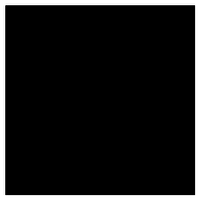
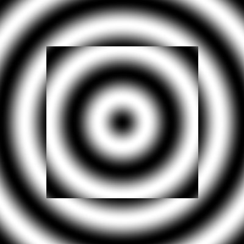
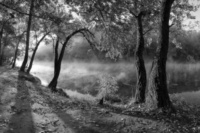

# Domácí úloha 6: Bitmapová grafika

**deadline: neděle 14. 12.**
(nutné, pokud chcete jít na předtermín, jinak stačí do neděle 21. 12.)

## Zadání

Implementujte následující funkce:

* vykreslení černého čtverce zadané velikosti na bílém podkladu zadané velikosti
* vykreslení černobílých vln (vlny jsou sinusoidy, tj. barva závísí na sinu
  vzádlenosti od středu)
* kombinace vln a čtverce (vlny fungují pořád stejně, oblast čtverce jen
  invertuje barvy)
* transformace obrázku do stupňů šedi

Všechny funkce výsledný obrázek zobrazí, transformace do stupňů šedi ho navíc i
uloží (pod libovolným názvem).

## Ukázka obrázků

### Čtverec


### Vlny


### Čtverec ve vlnách


### Stupně šedi



## Kostra řešení

```python
from PIL import Image

# definice konstant pro barvy
BLACK = (0, 0, 0)
WHITE = (255, 255, 255)


# vykresli cerny ctverec zadane velikosti na bily podklad zadane velikosti
def square(image_size=150, square_size=80):
    pass


# vykresli sinove kruhove vlny, parametr 'peaks' urcuje rychlost prubehu vln,
# tj. cim je vyssi, tim vice vln ("vrcholku sinu") na obrazku bude
# (na presnem poctu vrcholku tolik nezalezi)
def waves(image_size=150, peaks=5):
    pass


# vykresli sinove vlny zkombinovane se ctvercem, ktery invertuje barvy vln
def waves_square(image_size=150, peaks=15, square_size=100):
    pass


# prevede obrazek do stupnu sedi, vysledek ulozi i zobrazi
def grayscale(file_name):
    pass


# demo
square(150, 80)
waves(150, 5)
waves_square(150, 15, 100)
grayscale("obrazek.jpg")
```


## Důležité poznámky

* Odevzdejte jediný soubor `uloha06.py`, dodržte kostru řešení.
* Nepoužívejte diakritiku (ani v komentářích).
* Pracujte samostatně, za opisování je -30 bodů.
* Pokud chcete jít na předtermín, odevzdejte úlohu nejpozději do neděle 14. 12.
